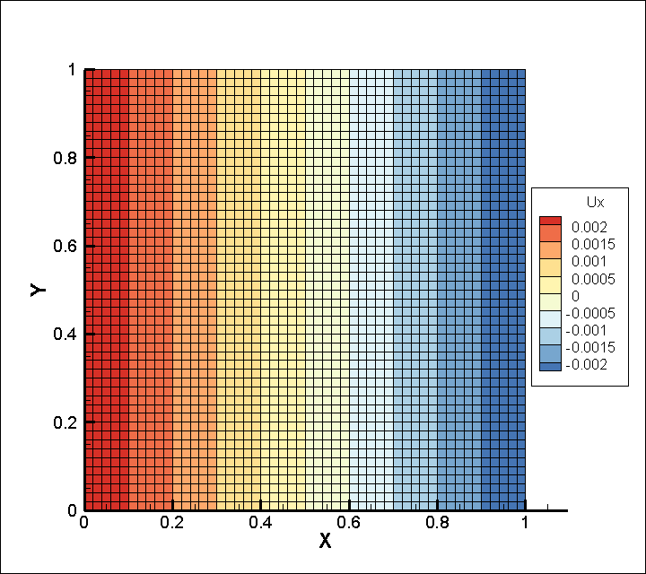
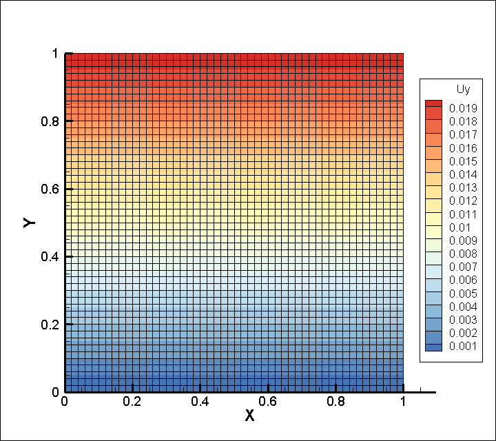
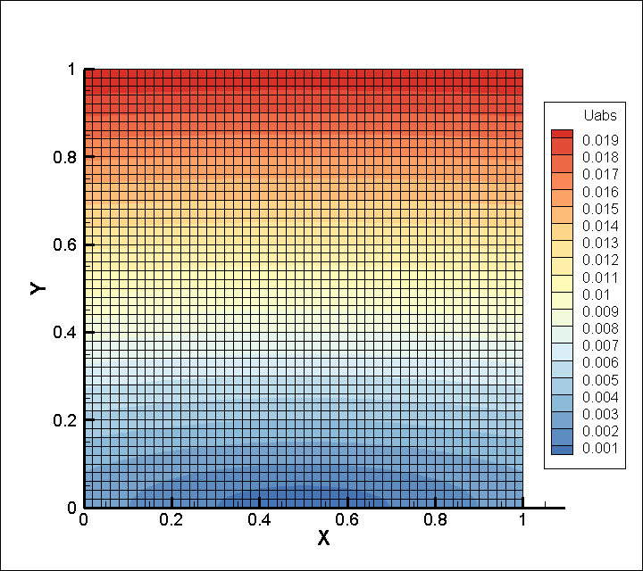

# Example 01 二维平面板单轴拉伸

## 〇、`hmsolver` 的前置环境依赖

* 基本数值计算库 `numpy`
* 科学数值计算库 `scipy`（主要使用到了稀疏矩阵模块 `scipy.sparse`）
* JIT 编译器库 `numba`（主要用于加速数值计算）
* 并行计算库 `joblib`（主要用于刚度矩阵的并行计算）

这里我们直接执行前一节的检验代码来获取当前运行环境的基础信息。


```python
!python check-systeminfo.py
```

    ================================================================
    CPU info:
        Name:       Intel(R) Xeon(R) Gold 5218R CPU @ 2.10GHz
        Logical:    40
        Physical:   20
        Usable:     40
    ================================================================
    Memory info:
        Total:      31.63 GB
        Free:       24.24 GB
        Available:  24.24 GB
    ================================================================
    Package requirements info:
        numpy:      1.19.2
        scipy:      1.5.2
        numba:      0.51.2
        joblib:     1.0.0
    ================================================================
    


```python
!python hmsolver-info.py
```

    ================================================================
    HMSolver info:
        Author:     Shangkun Shen(polossk)
        Email:      poloshensk@gmail.com
        Version:    0.5.0
        License:    GNU General Public License v3.0
    ================================================================
    

## 一、问题描述

* 几何信息
  * 长方形平面板（平面应力问题）
  * 几何尺寸 $1\text{m} \times 1\text{m}$ （长x宽）
* 材料信息
  * 各向同性均匀材料
  * 杨氏模量 $E = 300\text{GPa}$
  * 泊松比 $\nu = 0.25$
* 边界条件
  * 底边中点固定（固支）
  * 底边不发生 y 方向位移
  * 顶边设置 y 方向位移边界条件 $\bar{u}_y = 0.02\text{m}$
* 目标
  * 求解位移场，应力应变场信息

## 二、具体步骤

下面展示 `hmsolver` 如何求解二维平面应力问题。整个求解步骤分为以下 3 个步骤：定义问题，设置单元类型，问题求解。而对于问题的定义部分，则需要依次给出几何网格信息，材料性质信息和边界条件信息。现在依次讲解具体步骤及对应代码。

### 2.0 导入基本库

首先我们需要引入最核心的计算库 `numpy` 以方便之后的处理。其次引入 `time` 库用于统计整个代码的时间消耗。最后对于 `hmsolver` 库不建议全部引入，而选择用什么组件引入什么组件的方式。这样尽可能地保持代码的整洁。比如这里只是用了 `hmsolver.utils.formatting_time` 用于格式化时间用于输出，为了简洁只单独引入这个函数，如下所示。


```python
import numpy as np
import time

from hmsolver.utils import formatting_time
```

### 2.1 定义问题

下面依次给出问题的几何网格信息，材料性质信息和边界条件信息的具体步骤。

#### 2.1.1 设置几何区域并剖分网格

对于几何网格信息，我们需要预先定义整个问题的求解区域，再对区域进行网格剖分。在这里二维问题使用 `Zone2d` 类型进行包装。


```python
from hmsolver.meshgrid import Zone2d

zone_xl, zone_xr = 0, 1
zone_yl, zone_yr = 0, 1
zone_xmid = 0.5 * (zone_xl + zone_xr)
zone_ymid = 0.5 * (zone_yl + zone_yr)
zone = Zone2d(zone_xl, zone_xr, zone_yl, zone_yr)
```

定义好变量 `zone` 之后，我们对区域进行网格剖分。网格剖分时需要我们指定返回的类型，这里使用的是 `Mesh2d` 类型。另外需要注意的是，这里需要手动设置所有方向上的单元剖分个数。由于我们这里是正方形区域，所以默认的剖分方法此时得到的是正方形。如果要求不同方向剖分个数不同，则使用 `meshgrid_zone_safe_xy(x_num=Nx, y_num=Ny)` 来剖分网格。
在网格剖分之后，我们可以检查下网格的基本信息，例如节点个数和单元个数，下面给出示例。


```python
from hmsolver.meshgrid import Mesh2d

grid_num, grid_size = 50, 0.02
mesh2d = zone.meshgrid_zone_safe(Mesh2d, grid_num)
n_nodes, n_elements = mesh2d.n_nodes, mesh2d.n_elements

# 输出网格基本信息
print(f"Mesh contains {n_nodes} nodes and {n_elements} elements.")
print(f"Average Grid Size= {grid_size:.8f}")
```

    Mesh contains 2601 nodes and 2500 elements.
    Average Grid Size= 0.02000000
    

#### 2.1.2 材料信息

下面处理材料信息，由于是基础的连续介质力学问题，这里只要提供杨氏模量和泊松比就可以定义材料了。材料使用 `Material2d` 类型进行包装。


```python
from hmsolver.material import Material2d

material2d = Material2d(300, 0.25)
```

#### 2.1.3 边界条件信息

最后来处理我们的边界条件，边界条件涉及到的信息有边界条件类型（力边界条件、位移边界条件），所施加的边界（边界点、线段、曲线段），和所施加的值（常值、变化值）。

在这里，我们需先定义三条边界的判断条件，然后再用函数 `boundary_cond2d` 生成我们的真正的边界条件。边界位置判断信息这部分通过 `*_criteria` 实现。下面给出这个问题对应的位置判断函数。


```python
from hmsolver.femcore import point_criteria
from hmsolver.femcore import segment_criteria

boundary_0 = point_criteria(zone_xmid, zone_yl)
boundary_1 = segment_criteria(zone_xl, zone_yl, zone_xr, zone_yl)
boundary_2 = segment_criteria(zone_xl, zone_yr, zone_xr, zone_yr)
```

在定义好几何判断之后，我们直接组装成单独的边界条件，然后把他们存放至边界条件集合当中即可。在这里，每一个独立的边界条件用 `Boundary_Cond` 类型封装，而每一个问题所对应的边界条件集合用 `BoundaryConds2d` 类型封装。由于 `BoundaryConds2d` 继承于 `python` 的列表类（`list`），所以更加方便我们添加边界条件。对于这个问题，他总共用到了 3 条边界条件，我们逐一声明即可。

例如 `bondary_1` 对应的是底边的判断条件，由于底边不发生 y 方向的位移，所以设置 `set_uy` 为常数 `constant`，值为 0。最后把这些统统打包到 `boundarys` 当中，就大功告成了。

当我们的信息准备周全之后，就可以把这些都整理到真正的模拟问题 `Simulation2d` 当中。最后我们需要人工调用方法 `manually_verify()` 对边界条件进行人工确认。当然，你可以使用 `manually_halt()` 来人工取消认可。


```python
from hmsolver.femcore import boundary_cond2d as _bc_  # abbreviation
from hmsolver.femcore import BoundaryConds2d

stretch = 0.02
boundarys = BoundaryConds2d(
    _bc_("point", boundary_0, "fixed", None, None),
    _bc_("segment", boundary_1, "set_uy", "constant", 0),
    _bc_("segment", boundary_2, "set_uy", "constant", +stretch))
boundarys.manually_verify()
```

#### 2.1.4 组装问题

上述三个信息准备好之后，就可以组装到一起了。这里使用的是弹性力学模拟 `Simulation2d` 类型。在组装时，会自动的对其进行类型检查。


```python
from hmsolver.app import Simulation2d

app = Simulation2d(mesh2d, material2d, boundarys)
app.app_name = "example-01-plate-unixial-tensile"
```

比如我现在创建一个缺少材料信息的模拟实例 `app2`。注意到这里输出了错误提示，但凡出现错误提示的时候，整个实例是无法正确运行的。为了检查当前实例是否类型准确，可以人工调用方法 `type_check()` 进行检查。


```python
app2 = Simulation2d(mesh2d, None, boundarys)
```

    Material instance type ERROR.
    SHOULD BE Material2d object/subclass object.
    


```python
app.type_check()
```


    True


### 2.2 设置单元类型

在完成问题的定义之后，需要进一步指定与网格匹配的有限元单元类型。 `Simulation2d` 内置了 `check_engine()` 方法来检查是否准备万全。如果没有指定单元类型的话，将出现以下输出。


```python
app.check_engine()
```

    ********************************
    Simulation Manual Checking:
    Mesh is ready.
    Material is ready.
    Boundary Conds is ready.
    Basis is NOT ready.
    Failed.
    ********************************
    

在这里，我们使用平面的四边形等参一阶单元，这个单元的所有功能已经被封装到 `hmsolver.basis.Quad4Node` 当中，我们所需要做的就是将它应用到我们的模拟实例上，然后再检查一遍是否可以计算即可。

当输出 `OK` 时，就说明目前的问题已经没有信息缺失，可以执行计算任务了。


```python
from hmsolver.basis import Quad4Node

app.apply_basis(Quad4Node())
app.check_engine()
```

    ********************************
    Simulation Manual Checking:
    Mesh is ready.
    Material is ready.
    Boundary Conds is ready.
    Basis is ready.
    OK.
    ********************************
    

### 2.3 问题求解

目前模拟可以输出 6 种有价值的模拟结果数据，这里可以通过 `provied_solutions` 属性进行查阅。


```python
app.provied_solutions
```


    ['displace_field',
     'absolute_displace',
     'strain_field',
     'stress_field',
     'strain_energy_density',
     'distortion_energy_density']


这些数据的意义及调用方式如下

| 数据       |                          属性名 |      属性缩写 |
| :--------- | ------------------------------: | ------------: |
| 位移       |            `app.displace_field` |       `app.u` |
| 位移绝对值 |                `app.absolute_u` |   `app.u_abs` |
| 应变       |              `app.strain_field` | `app.epsilon` |
| 应力       |              `app.stress_field` |   `app.sigma` |
| 应变能     |     `app.strain_energy_density` |   `app.w_eps` |
| 畸变能     | `app.distortion_energy_density` |   `app.w_dis` |

## 三、后续处理

一般而言，可以直接通过 `app.provied_solutions` 直接计算出所有数据，并且打包到 tecplot 数据文件当中，用于后续的可视化处理。运行下面的代码后，你会发现运行目录多了两个文件 `ESM-2500-elements.bin` 和 `example-01-plate-unixial-tensile-elasticity.dat`。前者为数据文件，储存了当前网格下的单元刚度矩阵。后者为 tecplot 数据文件，记录了之前我们所想要的所有信息（位移场、位移绝对值、应力应变场、应变能、畸变能）。


```python
t0 = time.time()  # tic
app.export_to_tecplot("elasticity", *app.provied_solutions)
print(f"Total time cost: {formatting_time(time.time() - t0)}")
```

    Is parallelized= False
            perparation completed. Total 0.20s
            build stiffness martix k0 processing 17%, working on 426/2500, used 0.03s, eta 0.15s
            build stiffness martix k0 processing 34%, working on 851/2500, used 0.06s, eta 0.12s
            build stiffness martix k0 processing 51%, working on 1276/2500, used 0.09s, eta 0.09s
            build stiffness martix k0 processing 68%, working on 1701/2500, used 0.11s, eta 0.05s
            build stiffness martix k0 processing 85%, working on 2126/2500, used 0.15s, eta 0.03s
            generating completed. Total 0.16s
            mapping stiffness martix processing 17%, working on 426/2500, used 0.02s, eta 0.08s
            mapping stiffness martix processing 34%, working on 851/2500, used 0.04s, eta 0.07s
            mapping stiffness martix processing 51%, working on 1276/2500, used 0.05s, eta 0.05s
            mapping stiffness martix processing 68%, working on 1701/2500, used 0.07s, eta 0.03s
            mapping stiffness martix processing 85%, working on 2126/2500, used 0.08s, eta 0.01s
            assembling completed. Total 0.15s
    Solving Linear System: DOF=5202.
        quick_diff= 586.6666666719398 / 173.33333333597093 =  3.384615384594303
        Using fill_factor= 100
            Info= 0 == 0, successful exit.
    Linear System Solved. Time cost= 0.12s
    get_absolute_displace done.
    get_strain_field done.
    get_stress_field_single done.
    get_strain_energy_density done.
    get_distortion_energy_density done.
    Total time cost: 1.21s
    

当然如果单元过多的话可以开启多线程来加速运行，只需要将 `app.parallelized` 设置为 `True` 即可。和上面的代码类似，我们重新跑一边这个问题。可以从时间上发现多线程明显快于单线程版本。


```python
app.parallelized = True  # 开启并行多线程
app.check_engine() # 重新初始化
```

    ********************************
    Simulation Manual Checking:
    Mesh is ready.
    Material is ready.
    Boundary Conds is ready.
    Basis is ready.
    OK.
    ********************************
    


```python
t0 = time.time()  # tic
app.export_to_tecplot("elasticity", *app.provied_solutions)
print(f"Total time cost: {formatting_time(time.time() - t0)}")
```

    Is parallelized= True
            perparation completed. Total 0.20s
            generating completed (Parallel). Total 0.01s
            mapping stiffness martix processing 17%, working on 426/2500, used 0.02s, eta 0.10s
            mapping stiffness martix processing 34%, working on 851/2500, used 0.05s, eta 0.09s
            mapping stiffness martix processing 51%, working on 1276/2500, used 0.07s, eta 0.07s
            mapping stiffness martix processing 68%, working on 1701/2500, used 0.09s, eta 0.04s
            mapping stiffness martix processing 85%, working on 2126/2500, used 0.11s, eta 0.02s
            assembling completed. Total 0.17s
    Solving Linear System: DOF=5202.
        quick_diff= 586.6666666719398 / 173.33333333597093 =  3.384615384594303
        Using fill_factor= 100
            Info= 0 == 0, successful exit.
    Linear System Solved. Time cost= 0.12s
    get_absolute_displace done.
    get_strain_field done.
    get_stress_field_single done.
    get_strain_energy_density done.
    get_distortion_energy_density done.
    Total time cost: 1.07s
    

## 附录

### A. `example-01-plate-unixial-tensile.py` 文件内容

```python
import numpy as np
import time

from hmsolver.meshgrid import Zone2d
from hmsolver.meshgrid import Mesh2d
from hmsolver.material import Material2d
from hmsolver.femcore import point_criteria
from hmsolver.femcore import segment_criteria
from hmsolver.femcore import boundary_cond2d as _bc_  # abbreviation
from hmsolver.femcore import BoundaryConds2d
from hmsolver.app import Simulation2d
from hmsolver.basis import Quad4Node
from hmsolver.utils import formatting_time

if __name__ == '__main__':
    t0 = time.time()  # tic

    # 几何区域
    zone_xl, zone_xr = 0, 1
    zone_yl, zone_yr = 0, 1
    zone_xmid = 0.5 * (zone_xl + zone_xr)
    zone_ymid = 0.5 * (zone_yl + zone_yr)
    grid_num, grid_size = 50, 0.02
    zone = Zone2d(zone_xl, zone_xr, zone_yl, zone_yr)
    mesh2d = zone.meshgrid_zone_safe(Mesh2d, grid_num)
    n_nodes, n_elements = mesh2d.n_nodes, mesh2d.n_elements

    # 输出网格基本信息
    print(f"Mesh contains {n_nodes} nodes and {n_elements} elements.")
    print(f"Average Grid Size= {grid_size:.8f}")

    # 建立材料实例
    material2d = Material2d(300, 0.25)

    # 边界条件
    stretch = 0.02
    boundary_0 = point_criteria(zone_xmid, zone_yl)
    boundary_1 = segment_criteria(zone_xl, zone_yl, zone_xr, zone_yl)
    boundary_2 = segment_criteria(zone_xl, zone_yr, zone_xr, zone_yr)
    boundarys = BoundaryConds2d(
        _bc_("point", boundary_0, "fixed", None, None),
        _bc_("segment", boundary_1, "set_uy", "constant", 0),
        _bc_("segment", boundary_2, "set_uy", "constant", +stretch))
    boundarys.manually_verify()

    # 建立模拟实例
    app = Simulation2d(mesh2d, material2d, boundarys)
    app.app_name = "example-01-plate-unixial-tensile"
    app.apply_basis(Quad4Node())
    app.parallelized = True  # 开启并行多线程
    app.check_engine()

    # 输出模拟结果
    app.export_to_tecplot("elasticity", *app.provied_solutions)
    print(f"Total time cost: {formatting_time(time.time() - t0)}")
```

### B. 位移场可视化结果

|  |  |  |
| :-----------: | :-----------: | :---------------: |
|    x 方向     |    y 方向     |    位移绝对值     |

