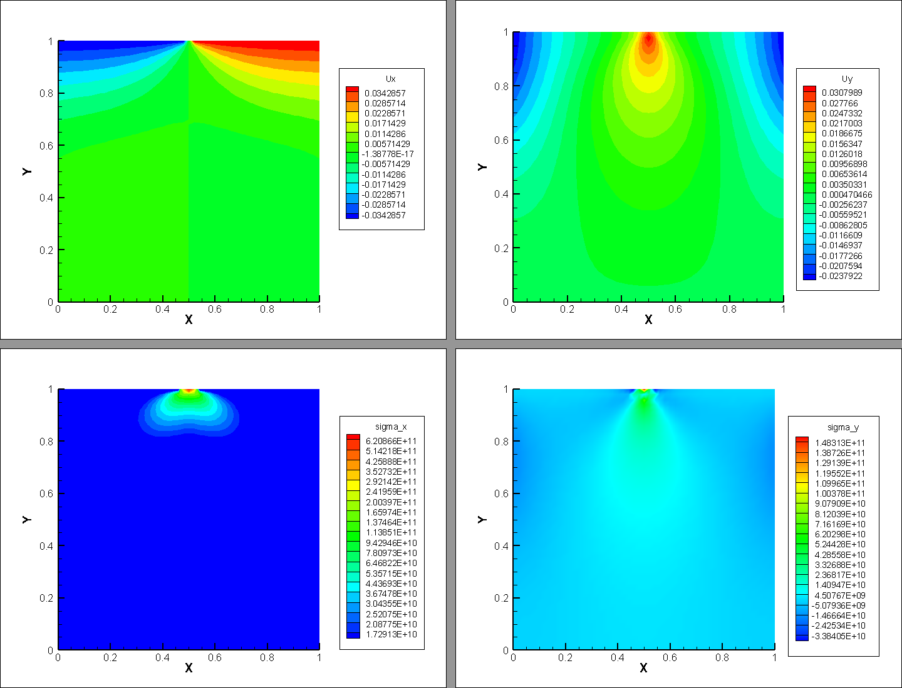
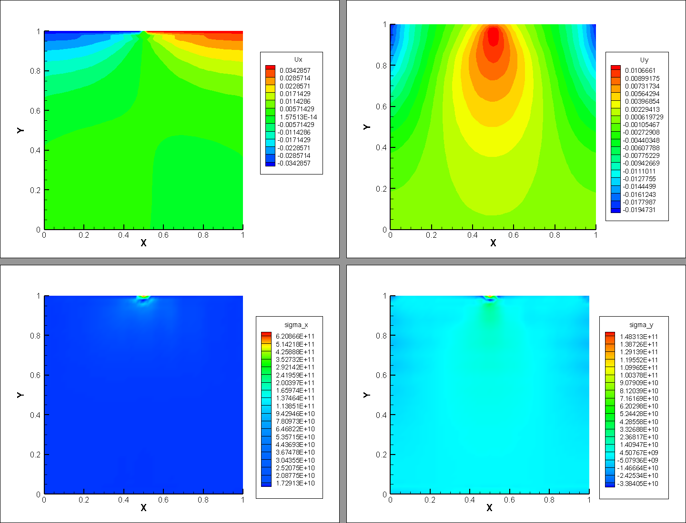
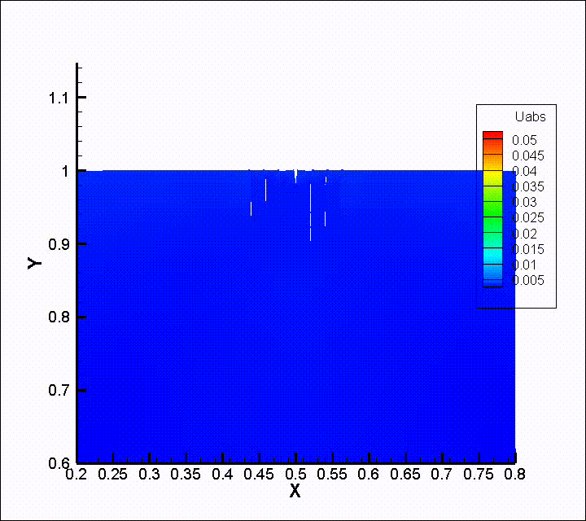
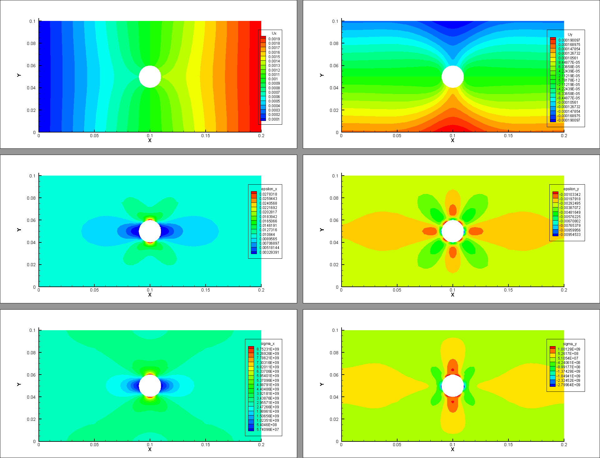
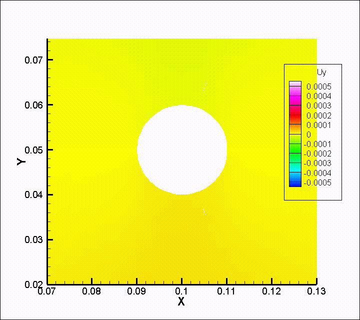

# hmsolver使用说明（二）二维平面板近场动力学有限元模拟

必须确保电脑安装有 `numpy` 及其他科学计算包，推荐使用 Anaconda 来进行包的管理。其次，安装本软件包 `hmsolver`（如果没有的话）。注意，以下内容建议使用 `jupyter` 来边读边写。

```python
!pip install hmsolver
```

安装完成之后，开始对着问题写代码就好了。如果之前安装过，建议检查下是否为最新版本。该文章发布时的版本号为0.2.1a90727。目前整个项目挂在 [PyPI](https://pypi.org/project/hmsolver/) 和 [GitHub](https://github.com/polossk/Hybrid-Model-Solver) 上，目前整个项目刚刚起步，还有很长的路要走。

## 问题描述

这里需要解决的问题是，现有一块尺寸为 1m x 1m 的平面板，平面板材料的杨氏模量是 300GPa，泊松比为 0.3333。其底边中点固定（固支），底边不发生 y 方向位移，顶边设置两个边界条件。左半段 x 方向位移边界条件 u1 = -0.04m，右半段 x 方向位移边界条件 u1 = 0.04m，也就是左右两端同时往外端拉。求整个平面板的位移场，应力应变场。

## 弹性力学模型求解

上一篇文章中提到了如何进行有限元求解，所以这里不再额外赘述，直接贴上代码。

```python
import numpy as np

import hmsolver.geometry as geometry
from hmsolver.meshgrid.zone2d import Zone2d
from hmsolver.femcore.treat_boundary import point_criteria, segment_criteria
from hmsolver.femcore.treat_boundary import boundary_cond2d, BoundaryConds2d
from hmsolver.app.simulation2d import Simulation2d
from hmsolver.meshgrid.mesh2d import Mesh2d
from hmsolver.material.material2d import Material2d
from hmsolver.basis.quad4 import Quad4Node

if __name__ == '__main__':
    zone_xl, zone_xr = 0, 1
    zone_yl, zone_yr = 0, 1
    zone_xmid = 0.5 * (zone_xl + zone_xr)
    zone_ymid = 0.5 * (zone_yl + zone_yr)
    grid_size = 0.02
    zone = Zone2d(zone_xl, zone_xr, zone_yl, zone_yr)
    mesh2d = zone.meshgrid_zone(Mesh2d, grid_size)

    material2d = Material2d(3e11, 1.0 / 3)

    stretch = 0.04
    boundary_0 = point_criteria(zone_xmid, zone_yl)
    boundary_1 = segment_criteria(zone_xl, zone_yl, zone_xr, zone_yl)
    boundary_2 = segment_criteria(zone_xl, zone_yr,
                                  zone_xmid - geometry.SPACING, zone_yr)
    boundary_3 = segment_criteria(zone_xmid + geometry.SPACING, zone_yr,
                                  zone_xr, zone_yr)
    _bc_ = boundary_cond2d  # abbreviate the word for type & read
    boundarys = BoundaryConds2d(
        _bc_("point", boundary_0, "fixed", None, None),
        _bc_("segment", boundary_1, "set_uy", "constant", 0),
        _bc_("segment", boundary_2, "set_ux", "constant", -stretch),
        _bc_("segment", boundary_3, "set_ux", "constant", +stretch))
    del _bc_  # delete the abbreviation
    boundarys.manually_verify()

    a = Simulation2d(mesh2d, material2d, boundarys)
    a.app_name = "plate"
    a.apply_basis(Quad4Node())
    a.check_engine()
    a.export_to_tecplot("elasticity", *a.provied_solutions)
```

大概 40 多行代码就可以完成我们所需要的信息了。考虑到节省篇幅，我们直奔主题，如何用 `hmsolver` 中的近场动力学模型进行求解。

## 近场动力学模型求解

近场动力学是一套新兴的非局部连续力学理论体系，它用局部空间积分方程代替偏微分方程用以描述局部物体的受力状况，从而避免了传统连续介质力学中的导数计算在遇到不连续状态时的奇异性，特别适用于模拟材料从完好无损到完全破坏的断裂过程。

当然对于这次的模拟问题，我们需要的信息有依旧是三大类：几何网格信息，材料性质信息和边界条件。与之前的操作类似，我们逐一定义这三种信息，来创建一个模拟问题实例。

对于几何网格信息，我们需要预先定义整个问题的求解区域，再对区域进行网格剖分。在这里二维问题使用 `Zone2d` 类型进行包装。

```python
from hmsolver.meshgrid.zone2d import Zone2d

zone_xl, zone_xr = 0, 1
zone_yl, zone_yr = 0, 1
zone_xmid = 0.5 * (zone_xl + zone_xr)
zone_ymid = 0.5 * (zone_yl + zone_yr)
zone = Zone2d(zone_xl, zone_xr, zone_yl, zone_yr)
```

定义好变量 `zone` 之后，我们对区域进行网格剖分。在这里，近场动力学所用的不再是一般形式的网格类型 `Mesh2d`，因为需要人工处理键的信息，所以在网格剖分时，需要我们指定的返回类型变更为 `HybridMesh2d` 类型。


```python
from hmsolver.meshgrid.hybrid_mesh2d import HybridMesh2d

grid_size = 0.02
mesh2d = zone.meshgrid_zone(HybridMesh2d, grid_size)
```

这样我们所需的几何网络信息已经暂时准备就绪了。随后处理材料信息。同样由于这次使用的是近场动力学模型，我们的材料信息也需要变更为合适的类型。在这里与之前类似，只要提供杨氏模量和泊松比就可以定义材料了。材料使用 `PdMaterial2d` 类型进行包装。如果对近场动力学有所了解的话，其实这里有一个关于泊松比取值的问题。事实上，对于一般的键型近场动力学模型，二维问题中泊松比的取值必须为 1/3，而三维问题中泊松比的取值必须为 0.25。这个是模型自身的限制，具体的证明不再赘述。

```python
from hmsolver.material.pd_material2d import PdMaterial2d

material2d = PdMaterial2d(3e11, 1.0 / 3)
```

最后来处理我们的边界条件，边界条件涉及到的信息有类型，所施加的边界，和所施加的值。每一个独立的边界条件用 `Boundary_Cond` 类型封装，而每一个问题所对应的边界条件集合用 `BoundaryConds2d` 类型封装。由于 `BoundaryConds2d` 继承于 python 的列表类（list），所以更加方便我们添加边界条件。对于这个问题，他总共用到了 4 条边界条件，我们逐一声明，并且最后调用方法 `manually_verify()` 对边界条件进行人工确认。

```python
from hmsolver.femcore.treat_boundary import point_criteria, segment_criteria
from hmsolver.femcore.treat_boundary import boundary_cond2d, BoundaryConds2d

stretch = 0.04
boundary_0 = point_criteria(zone_xmid, zone_yl)
boundary_1 = segment_criteria(zone_xl, zone_yl, zone_xr, zone_yl)
boundary_2 = segment_criteria(zone_xl, zone_yr,
                              zone_xmid - geometry.SPACING, zone_yr)
boundary_3 = segment_criteria(zone_xmid + geometry.SPACING, zone_yr,
                              zone_xr, zone_yr)
_bc_ = boundary_cond2d  # abbreviate the word for type & read
boundarys = BoundaryConds2d(
    _bc_("point", boundary_0, "fixed", None, None),
    _bc_("segment", boundary_1, "set_uy", "constant", 0),
    _bc_("segment", boundary_2, "set_ux", "constant", -stretch),
    _bc_("segment", boundary_3, "set_ux", "constant", +stretch))
del _bc_  # delete the abbreviation
boundarys.manually_verify()
```

网格、材料、边界信息准备就绪之后，我们组装这次的模拟实例。

```python
from hmsolver.app.simulation2d import PdSimulation2d

app = PdSimulation2d(mesh2d, material2d, boundarys)
app.app_name = "plate"
```

可以注意到，目前唯一的区别就是模拟的类型从 `Simulation2d` 变成了 `PdSimulation2d`，其他与之前的操作基本一致。不过距离可以模拟还有 3 个事情需要处理：预处理网格信息，提前找好单元与单元之间的键；处理材料信息，通过连续介质力学的参数在应变能相同的条件下计算近场动力学的本构参数；最后，指定有限元单元的类型，使其与网格相匹配即可。我们依次来执行。最后调用方法 `check_engine()` 来检查结果。

```python
from hmsolver.basis.quad4 import Quad4Node
horizon_radius = 0.06
inst_len = 0.015
app.material.setPeridynamic(horizon_radius, grid_size, inst_len)
app.mesh.peridynamic_construct(horizon_radius, 2 * horizon_radius,
                               4 * horizon_radius)
app.apply_basis(Quad4Node())
app.check_engine()
```

```plain
Synchronize Complete. Ratio= [ 1.  1.  1.]
Constitutive: (C11, C22, C33)= [  3.37500000e+11   3.37500000e+11   1.12500000e+11]
Peridynamic:  (C11, C22, C33)= [  3.37500000e+11   3.37500000e+11   1.12500000e+11]
building bonds processing 31%, working on 779/2500, eta 0h 0min 1.05s
building bonds processing 56%, working on 1412/2500, eta 0h 0min 0.73s
building bonds processing 76%, working on 1900/2500, eta 0h 0min 0.41s
building bonds processing 90%, working on 2244/2500, eta 0h 0min 0.18s
building bonds processing 98%, working on 2444/2500, eta 0h 0min 0.04s
building bond completed. Total 0h 0min 1.76s
********************************
Simulation Manual Checking:
Mesh is ready.
Material is ready.
Boundary Conds is ready.
Basis is ready.
OK.
********************************
```

在这里，`horizon_radius` 和 `inst_len` 分别表示近场动力学中的邻域半径和截断衰减参数。前者表示只有在这个半径范围内部才有非局部作用，后者则用在衰减系数当中，常用的衰减系数为 exp(|ξ|/inst_len)，ξ 表示 PD 模型中的键。可以看到执行完之后，检查结果 OK，一切就绪。和连续介质力学模型一样，目前模拟可以输出 5 种有价值的模拟结果数据，这里可以通过 `provied_solutions` 属性进行查阅。

```python
app.provied_solutions
```

```python
['displace_field',
 'absolute_displace',
 'strain_field',
 'stress_field',
 'distortion_energy']
```

这 5 种数据的意义及调用方式如下

|    数据    |         属性名          |   属性缩写    |
| :--------: | :---------------------: | :-----------: |
|    位移    |  `app.displace_field`   |    `app.u`    |
| 位移绝对值 |    `app.absolute_u`     |  `app.u_abs`  |
|    应变    |   `app.strain_field`    | `app.epsilon` |
|    应力    |   `app.stress_field`    |  `app.sigma`  |
|   畸变能   | `app.distortion_energy` |  `app.w_dis`  |

当然，你也可以全部计算，并且打包到 tecplot 数据文件当中来进行可视化。

```python
app.export_to_tecplot("peridynamic", *app.provied_solutions)
```

```plain
        assembling stiffness martix pd processing 17%, working on 426/2500, eta 0h 0min 40.38s
        assembling stiffness martix pd processing 34%, working on 851/2500, eta 0h 0min 34.24s
        assembling stiffness martix pd processing 51%, working on 1276/2500, eta 0h 0min 26.07s
        assembling stiffness martix pd processing 68%, working on 1701/2500, eta 0h 0min 17.35s
        assembling stiffness martix pd processing 85%, working on 2126/2500, eta 0h 0min 8.18s
        assembling completed. Total 0h 0min 53.98s
get_absolute_displace done.
get_strain_field done.
get_stress_field done.
get_distortion_energy done.
```

至此，你会发现运行目录多了两个文件 `PDSM-2500-elements.bin` 和 `plate-peridynamic.dat`。前者为数据文件，储存了当前网格下的单元的刚度矩阵。后者为 tecplot 数据文件，记录了之前我们所想要的所有信息（位移场、位移绝对值、应力应变场、畸变能）。我们直接用位移场与应力场的结果，和连续介质力学模型对比一下。（左上、右上、左下、右下依次为 x 方向位移、y 方向位移、x 方向应力、y 方向应力）


<center>连续介质力学模型</center>


<center>近场动力学模型</center>

注意到，两个模型的的结果并不完全相同。原因很容易理解：因为我们并没有处理边界效应。这里，连续介质力学由于是把材料作为连续体进行建模，所以即便是边界上，材料也是完整的。但是 PD 模型则不然，PD 模型如果不加以人工的边界处理的话，就会认为边界本身就是天然的残缺的部分（相对整个板子的中心位置而言），他的刚度在数值上的表现天然的小于板中央位置的刚度。所以这个是 feature，并不是 bug。

## 断裂模拟

读到这里，你应该对整个程序有所感觉：这是一个面向计算人员，而非面向用户的工具包。所以即便是绝大多数功能，我已经用 `hmsolver` 实现好了并且恰当封装，不过如果遇到了新产生的问题，仍旧需要编写一定量的代码来额外处理。而且，很多功能实际上属于定制化功能，除非必要，否则我不会封装进来。

那么如何用 `hmsolver` 进行断裂模拟呢？这里我们用两个算例来进行说明。

### 算例一：平面板顶边两端拉伸问题

我们依旧使用的是之前的算例，这里复述如下：

> 这里需要解决的问题是，现有一块尺寸为 1m x 1m 的平面板，平面板材料的杨氏模量是 300GPa，泊松比为 0.3333。其底边中点固定（固支），底边不发生 y 方向位移，顶边设置两个边界条件。左半段 x 方向位移边界条件 u1 = -0.04m，右半段 x 方向位移边界条件 u1 = 0.04m，也就是左右两端同时往外端拉。求整个平面板的位移场，应力应变场。

同样，我们仍然需要创建网格、材料以及边界条件，代码与上面完全一致。唯一的一点区别在于，这里我们需要使用的是 `CrackSimulation2d` 类型，这个类型是 `PdSimulation2d` 的子类，所以之前的这些方法统统都继承了下来。创建好之后预处理网格，材料，还有有限元单元类型。这里注意到，实际上我们还要给定一个参数，即键的最大伸长率，这个变量对应的应当是断裂失效过程中的宏观参数。不过现在只是随便看看，不用考虑太多，我们直接给定一个默认的值 1.1 就行了。

```python
app = CrackSimulation2d(mesh2d, material2d, boundarys)
app.app_name = "plate"
app.material.setPeridynamic(horizon_radius, grid_size, inst_len)
app.material.stretch_crit = 1.1
app.mesh.peridynamic_construct(horizon_radius, 2 * horizon_radius,
                               4 * horizon_radius)
app.apply_basis(Quad4Node())
app.check_engine()
```

这里我们假设这个材料是脆性材料，也就是其失效以破坏与断裂来表现。`hmsolver` 选用的是第四断裂准则，最大畸变能准则（其他准则后续可以添加，也可以人工实现）。当然因为我也不知道具体他会在哪里失效，我们姑且认为整体畸变能的最大值的 75% 是这个材料的极限好了。具体而言就是对整个模拟实例调用 `detect_failure()` 方法，参数就是最大畸变能；随后更新网格，让网格可以自由的断裂起来，最后运行模拟就行了。这里我们为了计算简单，让他跑 20 次模拟流程。

```python
app.detect_failure(0.75 * np.max(app.w_dis))
app.update_mesh()
app.run_simulation(1)
```

运行完之后你会发现生成了很多文件，这里简单介绍如下：

* plate-simulate-phase-xx-2500-elements：所有的模拟结果，即位移场、应力应变场、畸变能
* plate-simulate-phase-xx-2500-elements-alpha-exactly：权值函数的准确取值
* plate-simulate-phase-xx-2500-elements-alpha-roughly：权值函数的大致取值
* plate-simulate-phase-xx-2500-elements-deform：网格变形情况，默认只存储位移场数据

所以只需要手动的简单处理一下，送给 tecplot 处理就好了，这里展示一个变形结果。



### 算例二：带孔平面板的拉伸问题

下面讨论一个中央带孔的平面板拉伸问题。一块 0.2m x 0.1m 的平面板材料，中心有一个直径为 0.02 的圆形孔洞。材料的杨氏模量为30GPa，泊松比为 0.3333。左端中点固支，右端水平方向向右施加位移边界条件 u=0.005m。由于这次是一个复杂的求解区域了，我用了其他软件来生成网格，并且导入到 `hmsolver` 当中，网格信息只保留点的个数、点的坐标、单元个数和单元所依赖节点的信息即可。

```python
from hmsolver.femcore.preprocessing import read_mesh

input_file = 'data_2100_2000.msh'
n_nodes, n_elements, nodes, elements = read_mesh(input_file)
mesh2d = HybridMesh2d(n_nodes, n_elements)
mesh2d.manually_construct(np.array(nodes), np.array(elements))
```

同样的设置这次的参数，创建实例进行模拟。

```python
grid_size = 0.0015
horizon_radius = 0.0045
inst_len = 0.0005

app = CrackSimulation2d(mesh2d, material2d, boundarys)
app.app_name = "plate2"
app.material.setPeridynamic(horizon_radius, grid_size, inst_len)
app.material.stretch_crit = 1.1
app.mesh.peridynamic_construct(horizon_radius, 2 * horizon_radius,
                               4 * horizon_radius)
app.apply_basis(Quad4Node())
app.check_engine()

app.detect_failure(0.95 * np.max(app.w_dis))
app.update_mesh()
app.run_simulation(20)
```

这里同样给一个结果方便观察断裂情况。下图是位移场与应力应变场，视频是断裂动画。





至此，如何使用 `hmsolver` 包来进行静态问题模拟，静态断裂模拟已经全部介绍完毕。如果这个对您有帮助，欢迎点赞 [GitHub·Star](https://github.com/polossk/Hybrid-Model-Solver/stargazers) 或者参与到后续版本的开发过程当中。感谢阅读。
